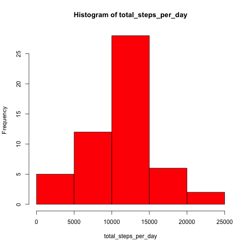
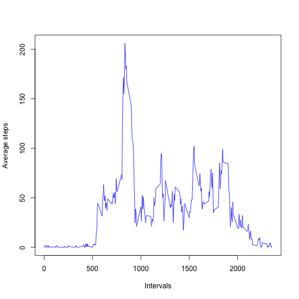
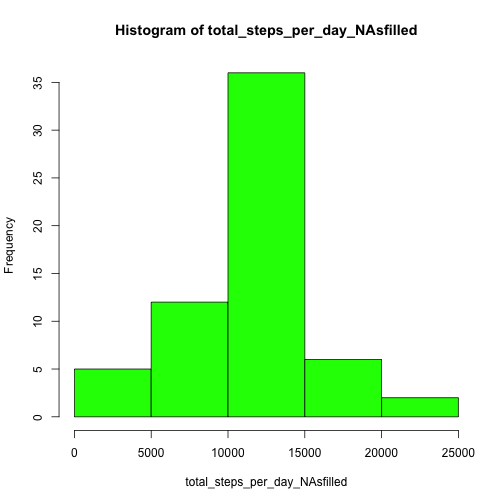
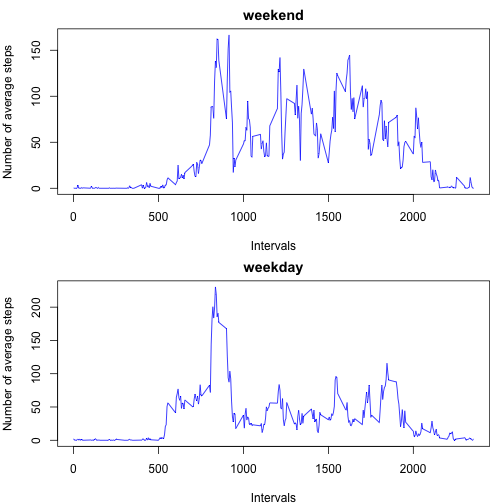

# Reproducible Research: Peer Assessment 1
============================================

## Loading and preprocessing the data
Load the data (i.e. read.csv())

```r
dataset <- read.csv("activity.csv", colClasses = "character")
```

Process/transform the data (if necessary) into a format 
suitable for your analysis

```r
steps_as_numeric <- as.numeric(dataset$steps)
dataset[,1] <- steps_as_numeric

date_as_date <- as.Date(dataset$date)
dataset[,2] <- date_as_date

interval_as_numeric <- as.numeric(dataset$interval)
dataset[,3] <- interval_as_numeric
```

A version of the dataset with NAs removed

```r
dataset_noNAs <- dataset[complete.cases(dataset),]
```

set up the margins and graphing parameters

```r
par(mar=c(3,4,1,1))
par(mfrow=c(1,1))
```


## What is mean total number of steps taken per day?
Consider the dataset after removing all the NAs: dataset_noNAs

Make a histogram of the total number of steps taken each day

```r
total_steps_per_day <- sapply(split(dataset_noNAs$steps, dataset_noNAs$date), sum)

hist(total_steps_per_day, col="Red")
```

 

Calculate and report the mean and median total number of steps
taken per day

Calculate the average/mean steps taken per day

```r
average_steps_per_day <- sapply(split(dataset_noNAs$steps, dataset_noNAs$date), mean)
average_steps_per_day
```

```
## 2012-10-02 2012-10-03 2012-10-04 2012-10-05 2012-10-06 2012-10-07 
##     0.4375    39.4167    42.0694    46.1597    53.5417    38.2465 
## 2012-10-09 2012-10-10 2012-10-11 2012-10-12 2012-10-13 2012-10-14 
##    44.4826    34.3750    35.7778    60.3542    43.1458    52.4236 
## 2012-10-15 2012-10-16 2012-10-17 2012-10-18 2012-10-19 2012-10-20 
##    35.2049    52.3750    46.7083    34.9167    41.0729    36.0938 
## 2012-10-21 2012-10-22 2012-10-23 2012-10-24 2012-10-25 2012-10-26 
##    30.6285    46.7361    30.9653    29.0104     8.6528    23.5347 
## 2012-10-27 2012-10-28 2012-10-29 2012-10-30 2012-10-31 2012-11-02 
##    35.1354    39.7847    17.4236    34.0938    53.5208    36.8056 
## 2012-11-03 2012-11-05 2012-11-06 2012-11-07 2012-11-08 2012-11-11 
##    36.7049    36.2465    28.9375    44.7326    11.1771    43.7778 
## 2012-11-12 2012-11-13 2012-11-15 2012-11-16 2012-11-17 2012-11-18 
##    37.3785    25.4722     0.1424    18.8924    49.7882    52.4653 
## 2012-11-19 2012-11-20 2012-11-21 2012-11-22 2012-11-23 2012-11-24 
##    30.6979    15.5278    44.3993    70.9271    73.5903    50.2708 
## 2012-11-25 2012-11-26 2012-11-27 2012-11-28 2012-11-29 
##    41.0903    38.7569    47.3819    35.3576    24.4688
```

Calculate the median steps taken per day

```r
median_steps_per_day <- sapply(split(dataset_noNAs$steps, dataset_noNAs$date), median)
median_steps_per_day
```

```
## 2012-10-02 2012-10-03 2012-10-04 2012-10-05 2012-10-06 2012-10-07 
##          0          0          0          0          0          0 
## 2012-10-09 2012-10-10 2012-10-11 2012-10-12 2012-10-13 2012-10-14 
##          0          0          0          0          0          0 
## 2012-10-15 2012-10-16 2012-10-17 2012-10-18 2012-10-19 2012-10-20 
##          0          0          0          0          0          0 
## 2012-10-21 2012-10-22 2012-10-23 2012-10-24 2012-10-25 2012-10-26 
##          0          0          0          0          0          0 
## 2012-10-27 2012-10-28 2012-10-29 2012-10-30 2012-10-31 2012-11-02 
##          0          0          0          0          0          0 
## 2012-11-03 2012-11-05 2012-11-06 2012-11-07 2012-11-08 2012-11-11 
##          0          0          0          0          0          0 
## 2012-11-12 2012-11-13 2012-11-15 2012-11-16 2012-11-17 2012-11-18 
##          0          0          0          0          0          0 
## 2012-11-19 2012-11-20 2012-11-21 2012-11-22 2012-11-23 2012-11-24 
##          0          0          0          0          0          0 
## 2012-11-25 2012-11-26 2012-11-27 2012-11-28 2012-11-29 
##          0          0          0          0          0
```


## What is the average daily activity pattern?
Consider the dataset after removing all the NAs: dataset_noNAs

Make a time series plot (i.e. type = "l") of the 5-minute interval
(x-axis) and the average number of steps taken, averaged across
all days (y-axis)

Calculation of the x-(average_steps_per_interval) and y- (intervals) values for the plot

```r
average_steps_per_interval <- sapply(split(dataset_noNAs$steps, dataset_noNAs$interval), mean)
intervals_list <- split(dataset_noNAs$interval, dataset_noNAs$interval)
intervals <- names(intervals_list)
```

The plot of average steps taken over every interval in the dataset
across all days

```r
plot(intervals, average_steps_per_interval, type="l", xlab="Intervals", ylab="Average steps", col="Blue")
```

 

Which 5-minute interval, on average across all the days in the
dataset, contains the maximum number of steps?

```r
maximum_steps_interval <- max(average_steps_per_interval)
index_of_maximum_steps_interval <- match(maximum_steps_interval, average_steps_per_interval)
maximum_steps_5_minute_interval <- intervals[index_of_maximum_steps_interval]
maximum_steps_5_minute_interval
```

```
## [1] "835"
```


## Imputing missing values
Calculate and report the total number of missing values in the
dataset (i.e. the total number of rows with NAs)

```r
total_number_of_missing_values <- sum(is.na(dataset))
total_number_of_missing_values
```

```
## [1] 2304
```

Devise a strategy for filling in all of the missing values in the
dataset. The strategy does not need to be sophisticated. For
example, you could use the mean/median for that day, or the mean
for that 5-minute interval, etc.
My strategy: replace all the NAs with the mean for the corresponding 5-minute interval in that row

Create a copy of the original dataset that will have the missing data (i.e., the NA values) filled in.

```r
dataset_NAsfilled <- read.csv("activity.csv", colClasses = "character")
```

Process/transform the data into a format 
suitable for your analysis

```r
steps_as_numeric <- as.numeric(dataset_NAsfilled$steps)
dataset_NAsfilled[,1] <- steps_as_numeric

date_as_date <- as.Date(dataset_NAsfilled$date)
dataset_NAsfilled[,2] <- date_as_date

interval_as_numeric <- as.numeric(dataset_NAsfilled$interval)
dataset_NAsfilled[,3] <- interval_as_numeric
```

Process/transform the dataset by replacing the NA values with the mean for the corresponding 5-minute interval

```r
for (i in seq(intervals)) {
        interval <- as.numeric(intervals[i])
        
        for (row in seq(dataset_NAsfilled$steps)) {
                if (is.na(dataset_NAsfilled$steps[row]) && dataset_NAsfilled$interval[row] == interval) {
                        dataset_NAsfilled$steps[row] = average_steps_per_interval[i]
                }
        }
}
```
Make a histogram of the total number of steps taken each day

```r
total_steps_per_day_NAsfilled <- sapply(split(dataset_NAsfilled$steps, dataset_NAsfilled$date), sum)

hist(total_steps_per_day_NAsfilled, col="Green")
```

 

Calculate and report the mean and median total number of steps 
taken per day.

```r
average_steps_per_day_NAsfilled <- sapply(split(dataset_NAsfilled$steps, dataset_NAsfilled$date), mean)
average_steps_per_day_NAsfilled
```

```
## 2012-10-01 2012-10-02 2012-10-03 2012-10-04 2012-10-05 2012-10-06 
##    37.3826     0.4375    39.4167    42.0694    46.1597    53.5417 
## 2012-10-07 2012-10-08 2012-10-09 2012-10-10 2012-10-11 2012-10-12 
##    38.2465    37.3826    44.4826    34.3750    35.7778    60.3542 
## 2012-10-13 2012-10-14 2012-10-15 2012-10-16 2012-10-17 2012-10-18 
##    43.1458    52.4236    35.2049    52.3750    46.7083    34.9167 
## 2012-10-19 2012-10-20 2012-10-21 2012-10-22 2012-10-23 2012-10-24 
##    41.0729    36.0938    30.6285    46.7361    30.9653    29.0104 
## 2012-10-25 2012-10-26 2012-10-27 2012-10-28 2012-10-29 2012-10-30 
##     8.6528    23.5347    35.1354    39.7847    17.4236    34.0938 
## 2012-10-31 2012-11-01 2012-11-02 2012-11-03 2012-11-04 2012-11-05 
##    53.5208    37.3826    36.8056    36.7049    37.3826    36.2465 
## 2012-11-06 2012-11-07 2012-11-08 2012-11-09 2012-11-10 2012-11-11 
##    28.9375    44.7326    11.1771    37.3826    37.3826    43.7778 
## 2012-11-12 2012-11-13 2012-11-14 2012-11-15 2012-11-16 2012-11-17 
##    37.3785    25.4722    37.3826     0.1424    18.8924    49.7882 
## 2012-11-18 2012-11-19 2012-11-20 2012-11-21 2012-11-22 2012-11-23 
##    52.4653    30.6979    15.5278    44.3993    70.9271    73.5903 
## 2012-11-24 2012-11-25 2012-11-26 2012-11-27 2012-11-28 2012-11-29 
##    50.2708    41.0903    38.7569    47.3819    35.3576    24.4688 
## 2012-11-30 
##    37.3826
```

```r
median_steps_NAsfilled <- sapply(split(dataset_NAsfilled$steps, dataset_NAsfilled$date), median)
median_steps_NAsfilled
```

```
## 2012-10-01 2012-10-02 2012-10-03 2012-10-04 2012-10-05 2012-10-06 
##      34.11       0.00       0.00       0.00       0.00       0.00 
## 2012-10-07 2012-10-08 2012-10-09 2012-10-10 2012-10-11 2012-10-12 
##       0.00      34.11       0.00       0.00       0.00       0.00 
## 2012-10-13 2012-10-14 2012-10-15 2012-10-16 2012-10-17 2012-10-18 
##       0.00       0.00       0.00       0.00       0.00       0.00 
## 2012-10-19 2012-10-20 2012-10-21 2012-10-22 2012-10-23 2012-10-24 
##       0.00       0.00       0.00       0.00       0.00       0.00 
## 2012-10-25 2012-10-26 2012-10-27 2012-10-28 2012-10-29 2012-10-30 
##       0.00       0.00       0.00       0.00       0.00       0.00 
## 2012-10-31 2012-11-01 2012-11-02 2012-11-03 2012-11-04 2012-11-05 
##       0.00      34.11       0.00       0.00      34.11       0.00 
## 2012-11-06 2012-11-07 2012-11-08 2012-11-09 2012-11-10 2012-11-11 
##       0.00       0.00       0.00      34.11      34.11       0.00 
## 2012-11-12 2012-11-13 2012-11-14 2012-11-15 2012-11-16 2012-11-17 
##       0.00       0.00      34.11       0.00       0.00       0.00 
## 2012-11-18 2012-11-19 2012-11-20 2012-11-21 2012-11-22 2012-11-23 
##       0.00       0.00       0.00       0.00       0.00       0.00 
## 2012-11-24 2012-11-25 2012-11-26 2012-11-27 2012-11-28 2012-11-29 
##       0.00       0.00       0.00       0.00       0.00       0.00 
## 2012-11-30 
##      34.11
```

Do these values differ from the estimates from the first part of
the assignment? What is the impact of imputing missing data on 
the estimates of the total daily number of steps? 

Yes, the values differ from the estimates from the first part of
the assignment. The frequency of steps has gone up in every 5-minute interval category as seen in the green histogram. 
Moreover, the replacement of NA values with the corresponding row's 5-minute interval mean has given us higher mean and median values.
Please note that a lot of the median values for both parts of the
assignment are 0 since 0 appears a lot in the given data itself.


## Are there differences in activity patterns between weekdays and weekends?
Create a new factor variable in the dataset with two levels – “weekday” and “weekend” indicating whether a given date is a weekday or weekend day.

```r
weekday <- vector(mode="character")
day_of_the_week <- weekdays(dataset_NAsfilled$date)

for (i in seq(dataset_NAsfilled$steps)) {
        #print(i)
        day <- day_of_the_week[i]
        if (day == "Saturday" || day == "Sunday") {
                weekday <- append(weekday, "weekend")
        }
        else {
                weekday <- append(weekday, "weekday")
        }
}
```

Modify the data frame with the weekday/weekend column/factor

```r
dataset_modified <- cbind(dataset_NAsfilled, weekday)
```

Make a panel plot containing a time series plot (i.e. type = "l")
of the 5-minute interval (x-axis) and the average number of 
steps taken, averaged across all weekday days or weekend 
days (y-axis). 

Weekday data

```r
weekday_dataframe <- dataset_modified[dataset_modified$weekday == "weekday",]
average_steps_weekday <- sapply(split(weekday_dataframe$steps, weekday_dataframe$interval), mean)
interval1_list <- split(weekday_dataframe$interval, weekday_dataframe$interval)
interval1 <- names(interval1_list)
```

Weekend data

```r
weekend_dataframe <- dataset_modified[dataset_modified$weekday == "weekend",]
average_steps_weekend <- sapply(split(weekend_dataframe$steps, weekend_dataframe$interval), mean)
interval2_list <- split(weekend_dataframe$interval, weekend_dataframe$interval)
interval2 <- names(interval2_list)
```

Set up the margins and plot

```r
par(mar=c(4,4,2,1))
par(mfrow=c(2,1))

plot(interval2, average_steps_weekend, type="l", xlab="Intervals", ylab="Number of average steps", col="Blue", main="weekend")
plot(interval1, average_steps_weekday, type="l", xlab="Intervals", ylab="Number of average steps", col="Blue", main="weekday")
```

 
